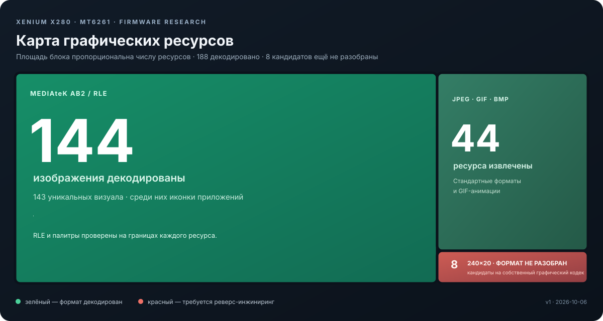

# X | Xenium X280: исследование прошивки

Реверс-инжиниринг дампа кнопочного телефона Xenium X280 на MT6261. Здесь фиксируются проверенные форматы, извлечённые ресурсы, карты указателей и следующие шаги. Это рабочий журнал исследования, а не готовая реконструкция исходного кода телефона.

> **Статус:** контейнеры ресурсов и изображения частично разобраны. Полный дизассемблированный/декомпилированный код, запуск прошивки в эмуляторе и проверенная перепаковка всего дампа пока отсутствуют.

## Три карты

1. [Карта дампа и LZMA-ресурсов](maps/firmware.md) — повторяющиеся области, маркеры, заголовки и каталог из 42 указателей.
2. [Карта изображений](maps/images.md) — JPEG/GIF/BMP и MediaTek AB2, источники, группы и незавершённые форматы.
3. [Карта строк и локализаций](maps/strings.md) — UTF-16LE блоки, найденные русские подписи и кандидаты на таблицу языковых ресурсов.

Машиночитаемые данные лежат в [`data/`](data/), ход анализа — в [`analysis/reverse-engineering-log.md`](analysis/reverse-engineering-log.md).

## Подтверждённые результаты

- Исходный файл дампа имеет размер 16 MiB и состоит из четырёх одинаковых 4-MiB копий; основная работа ведётся по уникальной первой копии.
- Найдены 57 little-endian маркеров `5C 00 00 40`. 55 блоков распакованы ровно до длины из LZMA-Alone заголовка; один кандидат имеет некорректные поля, один не распаковывается.
- Восстановлены **188 вхождений графических ресурсов**: 44 JPEG/GIF/BMP и 144 MediaTek AB2. Это 187 уникальных изображений; одно изображение встречается дважды.
- Подтверждён непрерывный каталог из 42 указателей на сжатые группы ресурсов. Сам каталог пока не даёт имён приложений.
- Найден кандидат на отдельную карту языковых ресурсов около `0x11E1C0`; шесть целевых блоков содержат большие наборы UTF-16LE строк.
- Изменён и без потерь перепакован один ресурс в исходный слот того же размера. Полная прошивка не пересобиралась и не проверялась на телефоне.

## Что здесь не заявляется

- Это не исходный код производителя и пока не полный декомпилятор. Большая часть прошивки ещё требует анализа машинного кода.
- Перекодирование одного элемента в слот прежнего размера не доказывает, что безопасно увеличивать ресурсы или прошивать изменённый дамп.
- В репозитории нет исходного полного дампа, NVRAM, IMEI или пользовательских данных. Не прошивайте результаты этого исследования.

## Следующие задачи

- Разобрать таблицы ресурсов и сопоставить иконки с ID приложений и экранами.
- Подтвердить структуру каталога строк и смысл третьего поля в дескрипторах.
- Расшифровать отдельные блоки `240×20`.
- Начать анализ кода MT6261: точки входа, таблицы вызовов и потребители каталогов ресурсов.
- Проверить перепаковку растущих блоков только на копии дампа и без записи в телефон.

## Источники форматов

- [MAUI / MediaTek MT6261 — LPCWiki](https://lpcwiki.miraheze.org/wiki/MTK_systems-on-chip/MT6261)
- [Исходник MediaTek GDI AB2 decoder](https://github.com/duxinglang-1/KJX_K7/tree/35dcd3de982792ae4d021e0e94ca6502d1ff876e/plutommi/Framework/GDI/GDISrc)
